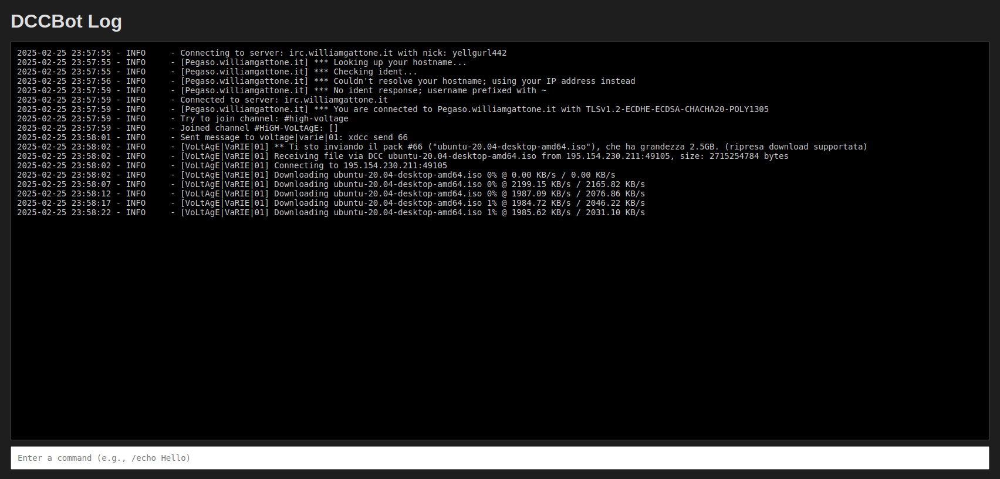
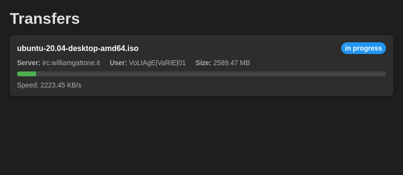

dccbot
========

An IRC XDCC download bot written in python with aiohttp and [irc.py](https://github.com/jaraco/irc).

Features
--------

*   join channels
*   send messages to channels or users
*   part channels
*   support for dcc connections
*   support for receiving files over dcc

Usage
-----

### Configuration

The bot can be configured by creating a `config.json` file in the current working
directory. The configuration file should contain a json object with the following
keys:

*   `servers`: a list of servers the bot can connect to. Each server is an
    object with the following keys:
    *   `nick`: the nickname to use when connecting to the server, default: dccbot
    *   `nickserv_password`: the password to use when connecting to the server, optional
    *   `use_tls`: a boolean indicating whether to use tls when connecting to the
        server
    *   `verify_ssl`: a boolean indicating whether to verify the server ssl certificate
    *   `random_nick`: a boolean indicating whether to use a random nickname when
        connecting to the server
    *   `port`: the port to connect to, default: 6667
    *   `channels`: a list of channels to join when connecting to the server, optional
    *   `also_join`: a dictionary of channels to join if the specific channel is joined
    *   `rewrite_to_ssend`: a list of channels to rewrite xdcc send to ssend for users in this channels
*   `default_server_config`: same as `servers`, used if the server connected to is not in `servers`
*   `download_path`: the directory where the bot should download files
*   `allowed_mimetypes`: a list of mimetypes the bot should allow to be sent
    over dcc
*   `max_file_size`: the maximum size of a file to be sent over dcc
*   `channel_idle_timeout`: the number of seconds a channel can be idle before
    the bot will part the channel
*   `server_idle_timeout`: the number of seconds a server can be idle before
    the bot will disconnect from the server
*   `resume_timeout`: the number of seconds to wait for a resume response from the bot
    before aborting the transfer
*   `transfer_list_timeout`: the number of seconds after a finished/aborted transfer is removed
    from the transfer list in /info response
*   `auto_md5sum`: a boolean indicating to verify the md5sum of the file if
    the bot sends the md5sum as message on start of transfer or after successful transfer
    `incomplete_suffix`: a string that is appended to the filename while downloading.
    If file was transferred successfully this suffix is removed.
*   `ssend_map`: a dictionary of users which support ssend (secure send). xdcc send command is
    replaced with ssend for these users.
*   `allow_private_ips`: a boolean indicating whether to allow private ips in dcc send command
*   `http`: a dictionary with the following keys:
    *   `socket`: the path to the socket to use for the http server (instead of host and port)
    *   `port`: the port to bind the http server to, default: 8080
    *   `host`: the host to bind the http server to, default: localhost

### API

The bot can be controlled using a simple web interface. The web interface is
available at `http://localhost:8080/` by default.

*   `POST /join`: join a channel
*   `POST /part`: part a channel
*   `POST /msg`: send a message to a channel or user
*   `POST /shutdown`: shutdown the bot
*   `GET /info`: get information about the current status of the bot (networks, current transfers, finished transfers)

### Additional browser features:

*   `/log.html`: show log file via websocket, limit to 500 lines.
    
*   `/info.html`: show current transfers page
    

### Browser Userscript for Easy Downloads

A Violentmonkey userscript is provided to add download buttons to popular XDCC search websites, making it easy to send download commands directly to your DCCBot.

#### Supported Websites
- XDCC.eu
- NIBL

#### Installation

1. Install the [Violentmonkey](https://violentmonkey.github.io/get-it/) extension for your browser (open source and available for Chrome, Firefox, and other Chromium-based browsers)
2. Click the following link to install the script: [Install Script](https://luni.github.io/dccbot/userscript/add-dccbot-btn.js)

#### Configuration

1. After installation, click on the Violentmonkey extension icon
2. Open the installed `add-dccbot-btn` script's menu and choose "Set API Endpoint"
3. Enter your DCCBot API endpoint (e.g., `http://localhost:8080`)

#### Usage

- On XDCC.eu and NIBL, you'll see a "Down" button next to each search result
- Click the button to automatically send the download command to your DCCBot
- For NIBL, you can also select multiple items and use the "Download selected" button to batch download

#### Features
- One-click downloads from supported websites
- Batch download support on NIBL
- Customizable API endpoint
- Lightweight and fast