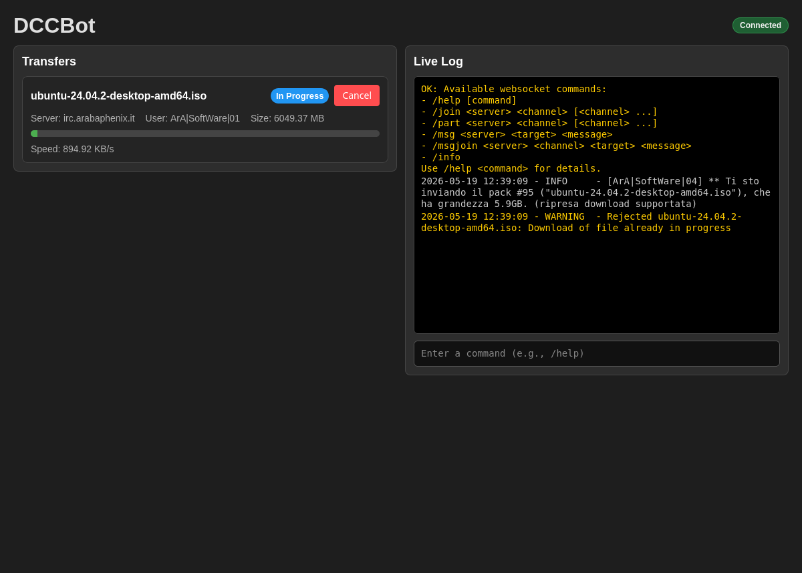
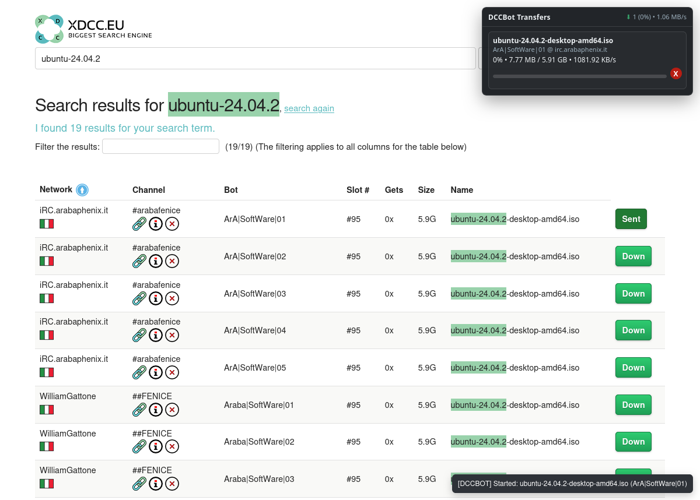

dccbot
========

An IRC XDCC download bot written in python with aiohttp and [irc.py](https://github.com/jaraco/irc).

Features
--------

* join channels (auto-join on connect, with `also_join` cascades)
* send messages to channels or users
* NickServ authentication
* random nickname generation
* TLS/SSL server connections (with optional certificate verification bypass)
* DCC file transfer support (SEND / RESUME / SSEND)
* SSL DCC (SSEND) support
* passive DCC (incoming connections) with configurable listen IP and port range
* MIME type filtering for received files
* file size limits
* private IP filtering for DCC transfers
* transfer cancellation via API
* auto-disconnect from idle servers and channels
* MD5 verification of completed transfers
* incomplete file suffix support (auto-renamed on completion)

Usage
-----

### Configuration

The bot can be configured by creating a `config.json` file in the current working
directory. The configuration file should contain a json object with the following
keys:

* `servers`: a dictionary of servers the bot can connect to, keyed by server address. Each server is an
    object with the following keys:
  * `nick`: the nickname to use when connecting to the server, default: dccbot
  * `nickserv_password`: the password to use when connecting to the server, optional
  * `use_tls`: a boolean indicating whether to use tls when connecting to the
        server
  * `verify_ssl`: a boolean indicating whether to verify the server ssl certificate
  * `random_nick`: a boolean indicating whether to use a random nickname when
        connecting to the server
  * `port`: the port to connect to, default: 6667
  * `channels`: a list of channels to join when connecting to the server, optional
  * `also_join`: a dictionary of channels to join if the specific channel is joined
  * `rewrite_to_ssend`: a list of channels to rewrite xdcc send to ssend for users in this channels
* `default_server_config`: same as `servers`, used if the server connected to is not in `servers`
* `default_download_path`: the directory where the bot should download files
* `allowed_mimetypes`: a list of mimetypes the bot should allow to be sent
    over dcc
* `max_file_size`: the maximum size of a file to be sent over dcc
* `channel_idle_timeout`: the number of seconds a channel can be idle before
    the bot will part the channel
* `server_idle_timeout`: the number of seconds a server can be idle before
    the bot will disconnect from the server
* `resume_timeout`: the number of seconds to wait for a resume response from the bot
    before aborting the transfer
* `transfer_list_timeout`: the number of seconds after a finished/aborted transfer is removed
    from the transfer list in /info response
* `auto_md5sum`: a boolean indicating to verify the md5sum of the file if
    the bot sends the md5sum as message on start of transfer or after successful transfer
* `incomplete_suffix`: a string that is appended to the filename while downloading.
    If file was transferred successfully this suffix is removed.
* `ssend_map`: a dictionary of users which support ssend (secure send). xdcc send command is
    replaced with ssend for these users.
* `allow_private_ips`: a boolean indicating whether to allow private ips in dcc send command
* `passive_dcc`: A boolean indicating whether to accept passive DCC transfers (where the peer sends port=0 and the bot listens for an incoming connection). This option can also be set per-server.
* `passive_dcc_listen_ip`: The IP address to bind the passive DCC listener to. If omitted, it defaults to the hostname's IP. This option can also be set per-server.
* `passive_dcc_port_range`: A list of two integers `[min_port, max_port]` defining the port range to try binding the listener to. If omitted, the OS assigns a port. This option can also be set per-server.
* `http`: a dictionary with the following keys:
  * `socket`: the path to the socket to use for the http server (instead of host and port)
  * `port`: the port to bind the http server to, default: 8080
  * `host`: the host to bind the http server to, default: localhost
  * legacy keys `bind_addr` and `bind_port` are still accepted for compatibility

### API

The bot can be controlled using a simple web interface. The web interface is
available at `http://localhost:8080/` by default.

* `POST /join`: join a channel
* `POST /part`: part a channel
* `POST /msg`: send a message to a channel or user
* `POST /cancel`: cancel a running transfer
* `POST /shutdown`: shutdown the bot
* `GET /info`: get information about the current status of the bot (networks, current transfers, finished transfers)
* `GET /ws`: WebSocket endpoint for live transfer updates and log streaming
* `GET /swagger`: interactive OpenAPI/Swagger UI documentation
* `GET /static/`: static web assets (unified web UI)

### Additional browser features

* `/`: unified web UI with current transfers, live log output, and websocket command input.

### WebSocket command help

In the browser command input, use:

* `/help` to show all websocket commands and signatures
* `/help <command>` to show usage and an example for a single command

Supported websocket commands:

* `/help [command]`
* `/join <server> <channel> [<channel> ...]`
* `/part <server> <channel> [<channel> ...]`
* `/msg <server> <target> <message>`
* `/msgjoin <server> <channel> <target> <message>`
* `/info`

### Browser Userscript for Easy Downloads

A Violentmonkey userscript is provided to add download buttons to popular XDCC search websites, making it easy to send download commands directly to your DCCBot.

#### Supported Websites

* XDCC.eu
* NIBL
* xdcc.rocks
* xdcc.animk.info
* xdcc-search.com
* xdcc.info
* sunxdcc.com

#### Installation

1. Install the [Violentmonkey](https://violentmonkey.github.io/get-it/) extension for your browser (open source and available for Chrome, Firefox, and other Chromium-based browsers)
2. Click the following link to install the script: [Install Script](https://luni.github.io/dccbot/userscript/add-dccbot-btn.js)

#### Configuration

1. After installation, click on the Violentmonkey extension icon
2. Open the installed `add-dccbot-btn` script's menu and choose "Set API Endpoint"
3. Enter your DCCBot API endpoint (e.g., `http://localhost:8080`)

#### Usage

* On supported sites (XDCC.eu, NIBL, xdcc.info, etc.), you'll see a "Down" button next to each search result
* Click the button to automatically send the download command to your DCCBot
* For NIBL, you can also select multiple items and use the "Download selected" button to batch download

#### Features

* One-click downloads from supported websites

* Batch download support on NIBL
* Customizable API endpoint
* Lightweight and fast

### Developer / Testing

The repository includes a full local development and testing setup:

* **Makefile targets**: `make test`, `make test-integration`, `make irc-up`, `make irc-down`, `make validate` (format + lint + complexity + security + type-check + vulture)
* **Docker Compose**: `docker compose up -d ircd` starts a local InspIRCd test server for integration tests
* **Dependabot**: configured for pip (weekly) and GitHub Actions (monthly)
